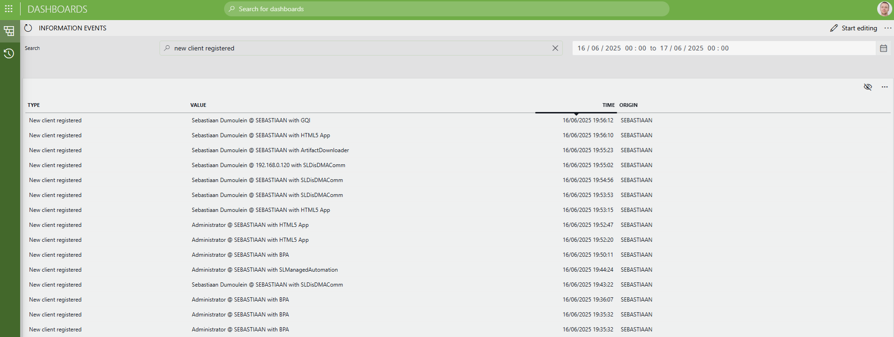

# Information Events Data Source

## About

The **Information Events Data Source** empowers users to efficiently access and analyze information events from their DataMiner System.

## Key Features

- **Filter by Time Range:** Instantly focus on events within a specific period to accelerate investigations.
- **Search Across Events:** Quickly locate events by searching both event type and value.
- **Efficient Paging:** Seamlessly browse large event sets with server-side paging for optimal performance.

## Use Cases

- **Incident Investigation:** Rapidly retrieve and review all relevant information events during a service disruption.
- **Operational Auditing:** Track changes or anomalies over time by filtering events within custom time windows.
- **Targeted Event Analysis:** Search for specific event types or values to support troubleshooting and reporting.

## Prerequisites

- DataMiner System without GQI DxM (DxM support is currently under development)

## Technical Reference

Source code available at: [https://github.com/SkylineCommunications/SLC-GQIDS-InformationEvents](https://github.com/SkylineCommunications/SLC-GQIDS-InformationEvents)
