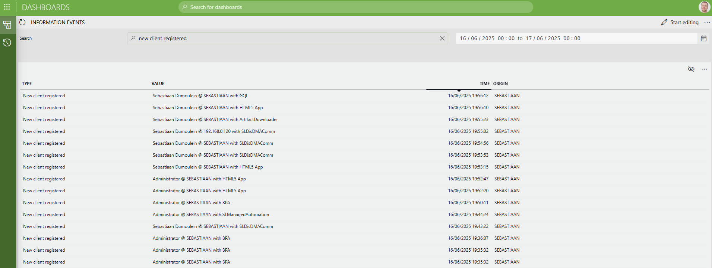

# Information Events Data Source

## About

The **Information Events Data Source** allows users to efficiently access and analyze information events from their DataMiner System.

## Key Features

- **Filter by time range**: Retrieve events within a specific period in order to accelerate investigations.
- **Search across events**: Quickly locate events by searching both event type and value.
- **Efficient paging**: Browse large event sets with server-side paging for optimal performance.

## Use Cases

- **Incident investigation**: Rapidly retrieve and review all relevant information events during a service disruption.
- **Operational auditing**: Track changes or anomalies over time by filtering events within a custom time window.
- **Targeted event analysis**: Search for specific event types or values for troubleshooting and reporting purposes.

## Prerequisites

- DataMiner System without GQI DxM, **or**
- DataMiner System with GQI DxM enabled (version 10.5.9 or higher required)
